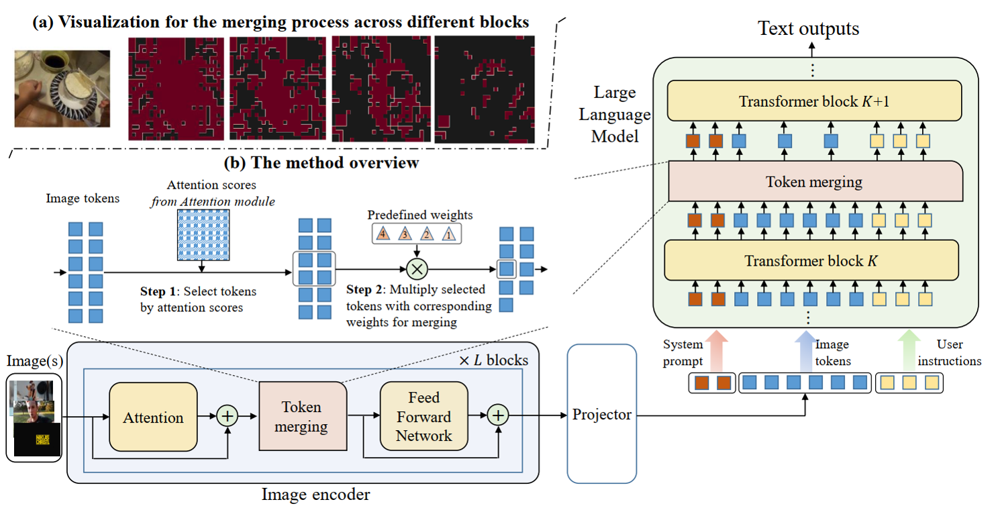
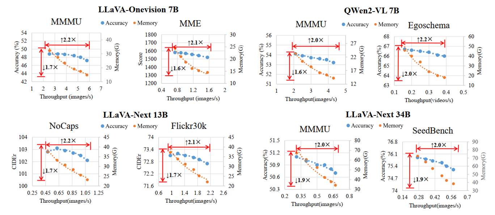
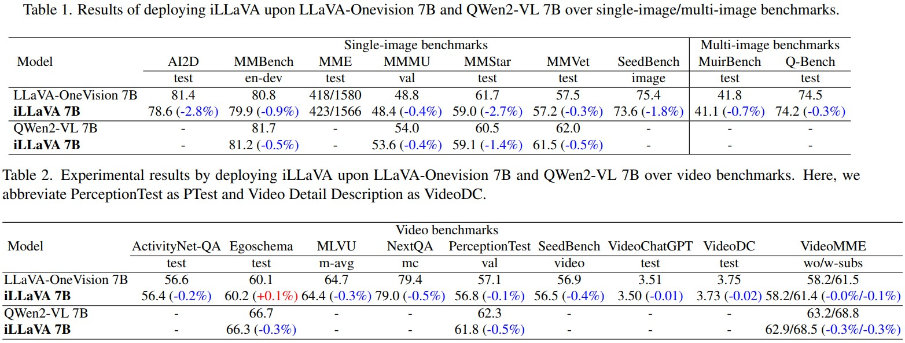
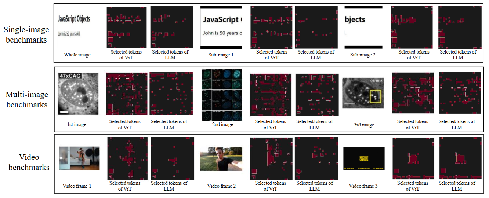

<h1 align="center">iLLaVA</h1>

<p align="center">
<a href="https://arxiv.org/pdf/2412.06263">
</a>


*iLLaVA is a efficient method for large vision language models by merging visual tokens. It could achieve about 2× throughput and 1.7× - 2× memory reduction with comparable performance through merging redundant visual tokens in some certain layers.*

<div align=center>

The framework of iLLaVA
</div>

<div align=center>

The efficiency of iLLaVA
</div>

<div align=center>

The generalizability of iLLaVA
</div>

<div align=center>

The visualization of iLLaVA
</div>
---
*Scheduled Updates🔥*

0. - [x] Setup
1. - [x] Inference and Evaluation
2. - [x] Visualizations
3. - [x] Supporting both image and video benchmarks

## Setup
```bash
conda create -n illava python=3.10
conda activate illava
bash setup.sh
```

*Notice that you should install `numpy=1.x` instead of `numpy=2.x`

## Inference
This repo provides the inference code for iLLaVA based on LLaVA-OneVision. 

1. You should manually download the pretrained weights for LLaVA-OneVision (e.g., LLaVA-OneVision 7B) from here, or conducting the following command to download 

```
pip install -U huggingface_hub
huggingface-cli download --resume-download lmms-lab/llava-onevision-qwen2-7b-ov --local-dir /path_to_your_dir --local-dir-use-symlinks False --resume-download
```
For users who are unable to visit huggingface (e.g., *China*), you can conduct the following command:
```
pip install -U huggingface_hub
HF_ENDPOINT=https://hf-mirror.com huggingface-cli download --resume-download lmms-lab/llava-onevision-qwen2-7b-ov --local-dir /path_to_your_dir --local-dir-use-symlinks False --resume-download
```

*We use different settings for image benchmarks and video benchmarks of iLLaVA.* Specifically, we reduce 364 tokens in the image encoder, which are merged in layers [5,6,7,8] for image benchmarks, and in layers [3,4,5,6] for video benchmarks. We reduce about 30% tokens in the language model, which are merged in layer 8 for image benchmarks, and in layer 2 for video benchmarks. We observe there exist more feature redundancy in videos which allow more aggressive token merging.

### Single-image benchmarks and Multi-image benchmarks
`lmms-eval     --model llava_onevision_training_free     --model_args pretrained=/path_to_your_checkpoint,conv_template=qwen_1_5,model_name=llava_qwen_training_free,device_map=auto,enable_illava_vit=True,illava_vit_k=5-6-7-8,illava_vit_r=92,enable_illava_llm=True,illava_llm_k=8,illava_llm_r=0.70     --task your_benchmark   --batch_size 1     --log_samples     --log_samples_suffix llava_onevision_7b --output_path ./logs`
### Video benchmarks
`lmms-eval     --model llava_onevision_training_free     --model_args pretrained=/path_to_your_checkpoint,conv_template=qwen_1_5,model_name=llava_qwen_training_free,device_map=auto,max_frames_num=32,enable_illava_vit=True,illava_vit_k=3-4-5-6,itllava_vit_r=92,enable_illava_llm=True,illava_llm_k=2,illava_llm_r=0.70     --task your_benchmark  --batch_size 1     --log_samples     --log_samples_suffix llava_onevision_7b --output_path ./log`

Replace the `/path_to_your_checkpoint` with the path to your downloaded LLaVA-OneVision pretrained weights.

If you are difficult to visit `https://huggingface.co/` (e.g., in *China*), place `HF_ENDPOINT=https://hf-mirror.com` in the begining of your command.

The log files are saved in `./logs`

## Visualization: the token merging process

### Single-image benchmarks and Multi-image benchmarks
`lmms-eval     --model llava_onevision_training_free     --model_args pretrained=/path_to_your_checkpoint,conv_template=qwen_1_5,model_name=llava_qwen_training_free,device_map=auto,enable_illava_vit=True,illava_vit_k=5-6-7-8,illava_vit_r=92,illava_track_vit_source=True,enable_illava_llm=True,illava_llm_k=8,illava_llm_r=0.70,illava_track_llm_source=True     --task your_benchmark   --batch_size 1     --log_samples     --log_samples_suffix llava_onevision_7b --output_path ./logs`
### Video benchmarks
`lmms-eval     --model llava_onevision_training_free     --model_args pretrained=/path_to_your_checkpoint,conv_template=qwen_1_5,model_name=llava_qwen_training_free,device_map=auto,max_frames_num=32,enable_illava_vit=True,illava_vit_k=2-3-4-5-6-7-8,itllava_vit_r=80,illava_track_vit_source=True,enable_illava_llm=True,illava_llm_k=2,illava_llm_r=0.50,illava_track_llm_source=True,mm_spatial_pool_stride=1     --task your_benchmark  --batch_size 1     --log_samples     --log_samples_suffix llava_onevision_7b --output_path ./log`

We here set a more aggressive merging procedure for video benchmarks to show better visualization results. You may modify the hyper-parameters by yourself.

Token merging visualizations for different layers would be stored with a prefix of `attention_map_vit_layer_{remained_token_num}` and attention_map_llm_layer_{remained_token_num}` for vit stages and llm stages in the current dir.

## Model hyper-parameters
Besides the original paramters of LLaVA-Onevision, we introduce several new paramters:

- `enable_illava_vit[Bool]`, whether enables using iLLaVA in the ViT stage. `Default: False`.
- `illava_vit_k[Str]`, the layers to merge tokens in the ViT stage. For example, `2-3-4-5` indicates layers [2,3,4,5]. `Default: None`.
- `illava_vit_r[Int]`, the number of tokens to be merged in each layer of the ViT stage. The overall number of merged tokens are the multiplication of `illava_vit_k` and `illava_vit_r`. `Default: 0`.
- `enable_illava_llm[Bool]`, whether enables using iLLaVA in the LLM stage. `Default: False`.
- `illava_llm_k[Str]`, the layers to merge tokens in the LLM stage. For example, `2` indicates layers [2]. `Default: None`.
- `illava_llm_r[Int]`, the number of tokens to be merged in each layer of the LLM stage. The overall number of merged tokens are the multiplication of `illava_llm_k` and `illava_llm_r`. `Default: 0`.
- `illava_llm_image_token_start_index[Int]`, the starting index of image tokens in the language model, which is predefined according to the system prompts. `Default: 14`.
- `illava_track_vit_source[Bool]`, whether performing visualization for the token merging process in the ViT stage. `Default: False`.
- `illava_track_llm_source[Bool]`, whether performing visualization for the token merging process in the ViT stage. `Default: False`.

You can set the corresponding parameters in the `model_args` of the command like we provide in the `inference` section.

## Model inplementation 

We mainly modify the following files to conduct different functions:
- [llava_qwen_training_free.py](./src/LLaVA-OneVision/llava/model/language_model/llava_qwen_training_free.py), which preprocess the inputs before feeding into the LVLM.
- [siglip_encoder.py](./src/LLaVA-OneVision/llava/model/multimodal_encoder/siglip_encoder.py), which implements the ViT.
- [builder.py](./src/LLaVA-OneVision/llava/model/builder.py), which defines the class `llava_onevision_training_free`
- [modeling_qwen2.py](./src/transformers-4.46.0/src/transformers/models/qwen2/modeling_qwen2.py), which implements the forward pass of LLM.
- [llava_onevision_training_free.py](./src/lmms_eval-0.2.4/lmms_eval/models/llava_onevision_training_free.py), which defines the model `llava_onevision_training_free` of model initialization and generation process.