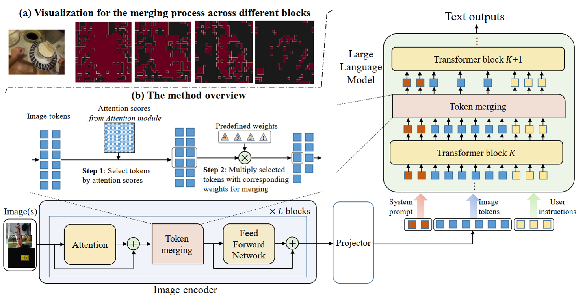
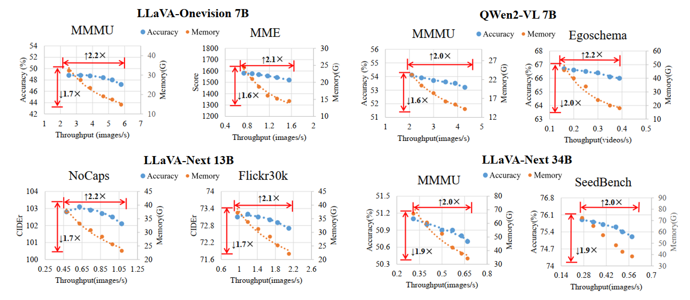
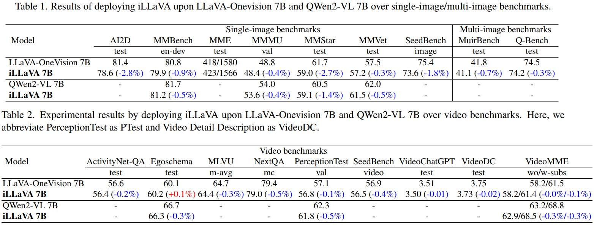
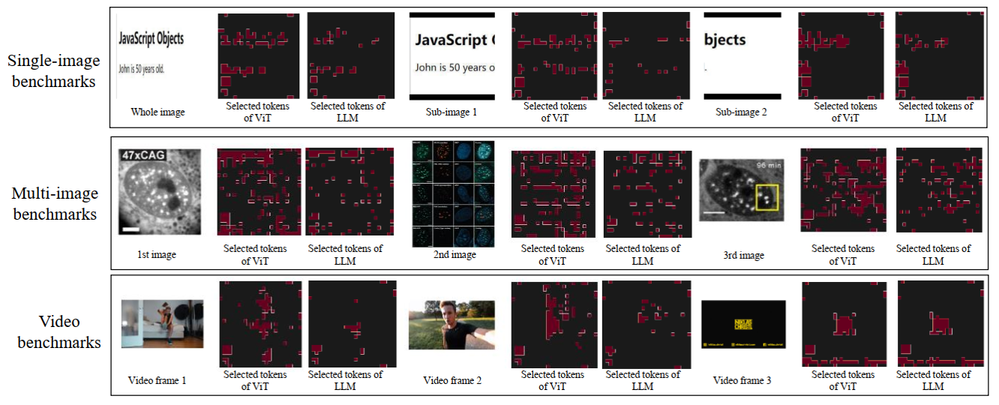
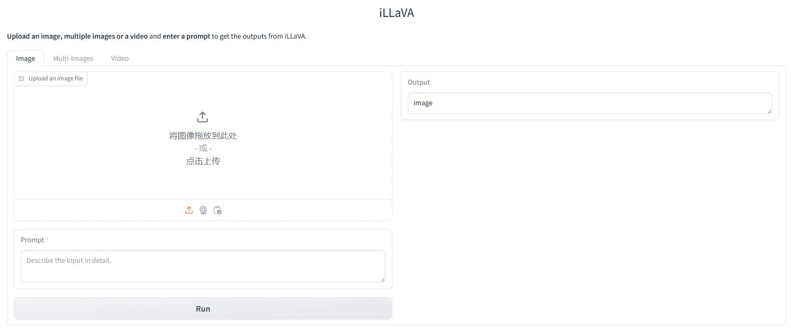

<h1 align="center">iLLaVA</h1>

<p align="center">
<a href="https://arxiv.org/pdf/2412.06263">
</a>

_**iLLaVA** is an efficient two-stage efficient method by recursively merging visual tokens within both the vision encoder and LLM for large vision language models. It could achieve about **2×** throughput and **1.7× - 2×** memory reduction with comparable performance through merging redundant visual tokens in some certain layers._

https://github.com/user-attachments/assets/62da6e0b-5787-4ecf-bf40-2d114df7b04c

<div align=center>

<h4> The web demo video</h4>
</div>

<div align=center>

<h4> Fig.1: The framework of iLLaVA</h4>
</div>

<!-- <div align=center>

<h4> Fig.2: The efficiency of iLLaVA </h4>
</div>

<div align=center>

<h4> Fig.3: The generalizability of iLLaVA </h4>
</div>

<div align=center>

<h4> Fig.4: The visualization of iLLaVA </h4>
</div> -->

*Scheduled Updates🔥*

0. - [x] Setup
1. - [x] Inference and Evaluation
2. - [x] Visualizations
3. - [x] Supporting both image and video benchmarks
4. - [x] Demo
5. - [x] Support Qwen3-VL, Qwen2-VL and LLaVA-Onevision

The main branch now supports **Qwen3-VL**. For **Qwen2-VL and LLaVA-Onevision**, please refers to the `Qwen2vl_LLaVAonevision` branch.

## 🧨Setup
```bash
conda create -n illava python=3.11
conda activate illava
bash setup.sh
```

*Notice that you should install `numpy=1.x` instead of `numpy=2.x`*

## 🎈Inference
This repo provides the inference code for iLLaVA, implemented based on [Qwen3-VL](https://github.com/QwenLM/Qwen3-VL). 

We use [VLMEvalKit](https://github.com/open-compass/VLMEvalKit) to conduct inference with Qwen3-VL. The pretrained weights of Qwen3-VL could be **automatically** downloaded during inference. You can also manually download the pretrained weight for Qwen3-VL (e.g., Qwen3-VL 8B) [here](https://huggingface.co/Qwen/Qwen3-VL-8B-Instruct), or conducting the following command to download it:

```
pip install -U huggingface_hub
huggingface-cli download --resume-download Qwen/Qwen3-VL-8B-Instruct --local-dir /path_to_your_dir --local-dir-use-symlinks False --resume-download
```
For users who are unable to visit huggingface (e.g., *China*), you can conduct the following command:
```
pip install -U huggingface_hub
HF_ENDPOINT=https://hf-mirror.com huggingface-cli download --resume-download Qwen/Qwen3-VL-8B-Instruct --local-dir /path_to_your_dir --local-dir-use-symlinks False --resume-download
```

#### Single-image and video benchmarks
```
cd src/VLMEvalKit
python run.py --data your_benchmark --model Qwen3-VL-8B-Instruct-iLLaVA --verbose --reuse
```

If you are using multiple gpus for evaluation, you can run the following command:

```
CUDA_VISIBLE_DEVICES=0,1,2,3 torchrun --nproc-per-node=4 run.py --data your_benchmark --model Qwen3-VL-8B-Instruct-iLLaVA --verbose --reuse
```

Set the `your_benchmark` as your target benchmark. The representative benchmarks include: MMMU_DEV_VAL (MMMU benchmark), MME (MME benchmark), MMStar (MMStar benchmark), MMBench_DEV_EN (MMBench benchmark), MMBench_DEV_EN_V11 (MMBench V1.1), MMVet (MMVet benchmark), AI2D_TEST (AI2D benchmark), ScienceQA_TEST (ScienceQA benchmark), MUIRBench (MuirBench benchmark), RealWorldQA (RealWorldQA benchmark), Video-MME_1fps (VideoMME benchmark). Other tasks supported by VLMEvalKit can be found in [supported tasks](https://aicarrier.feishu.cn/wiki/Qp7wwSzQ9iK1Y6kNUJVcr6zTnPe?table=tblsdEpLieDoCxtb&view=vewa8sGZrY).

The detailed args of iLLaVA for Qwen3-VL are defined in [config.py](https://github.com/hulianyuyy/iLLaVA/src/VLMEvalKit/vlmeval/config.py)

If you are difficult to visit `https://huggingface.co/` (e.g., in *China*), place `HF_ENDPOINT=https://hf-mirror.com` in the beginning of your command.

The output files are saved in `./VLMEvalKit/outputs`.
## ✨Visualization: the token merging process

The visualization of the token merging process is only supported for iLLaVA implemented with LLaVA-OneVision due to code issues. Please see the `Qwen2vl_LLaVAonevision` branch.

## 🍕Inference with one input
We provide a `.py` file to help users use iLLaVA by specifying one input. The acceptable inputs include a single image, multiple images or a video. 

The parameters you need to specify in the command include:
- `model_path`, which indicates the path to the pretrained model.
- `input_path`, which could be the path to an image file, the directory of multiple images or the path to a video file.
- `question`, which is the question proposed by the user. Different words should be separated by `-` for parsing the command. For example, the default input is `describe_the_input`.

Other parameters may refer to the `.py` file.

We provide `run_inference_once_qwen3vl.py` to conduct inference with one input.
#### Example: inputting a single image
`python run_inference_once_qwen3vl.py --model_path /path_to_your_checkpoint --question describe_the_input --input_path /path_to_your_image/xxx.jpg`

#### Example: inputting multiple images
`python run_inference_once_qwen3vl.py --model_path /path_to_your_checkpoint --question describe_the_input --input_path /path_to_your_images`

#### Example: inputting a video
`python run_inference_once_qwen3vl.py --model_path /path_to_your_checkpoint --question describe_the_input --input_path /path_to_your_video/xxx.mp4`

You could set `--max_frames_num 32` to set different input frames for input videos.
## 🎄Demo 
We provide a offline demo to help users deploy iLLaVA on their local machines. It supports inputting a single image, multiple images or a video, and the get the outputs from iLLaVA. 

### For Qwen3-VL
The command is shown as follows:

`python demo_qwen3vl.py --model_path /path_to_your_checkpoint` 

After running the command, you can visit `http://0.0.0.0:7862` to play with the demo. You can also change it into an public URL by setting `share=True` in the last line in `demo.py` or `demo_qwen3vl.py`.

Below is the visualization for our demo.

**Upload an image, multiple images or a video** and **enter a prompt** to get the outputs from iLLaVA

<div align=center>

<h4> Fig.5: The visualization of our demo </h4>
</div>

## 🎫Model hyper-parameters
Besides the original paramters of LLaVA-Onevision, we introduce several new paramters:

- `enable_illava_vit[bool]`, whether enables using iLLaVA in the ViT stage. `Default: True`.
- `illava_vit_k[str]`, the layers to merge tokens in the ViT stage. For example, `5-6-7-8` indicates layers [5,6,7,8]. `Default: 5-6-7-8`.
- `illava_vit_r[float]`, the ratio of tokens preserved in each layer of the ViT stage.  `Default: 0.85`.
- `illava_vit_mode[int]`, the mode of perform token merging in the ViT, 1=drop lowest, 2=shift-merge, 3=cluster Pv^i/Pv^c, `Default: 3`.
- `enable_illava_llm[bool]`, whether enables using iLLaVA in the LLM stage. `Default: True`.
- `illava_llm_k[str]`, the layers to merge tokens in the LLM stage. For example, `19-21-23-25` indicates layers [19,21,23,25]. `Default: 19-21-23-25`.
- `illava_llm_r[float]`, the ratio of tokens preserved in each layer of the LLM stage.  `Default: 0.9`.
- `illava_llm_mode[int]`, the mode of perform token merging in the LLM, 1=drop lowest, 2=shift-merge, 3=cluster Pv^i/Pv^c, `Default: 3`.

You can set the corresponding parameters in the `model_args` of the command like we provide in the `inference` section.

## 🛒Model inplementation 
We mainly modify the following files to conduct different functions:
- [model.py](src/VLMEvalKit/vlmeval/vlm/qwen3_vl/model.py), which defines the Qwen3 model and builds prompts.
- [modeling_qwen3_vl.py](src/transformers-4.57.4/src/transformers/models/qwen3_vl/modeling_qwen3_vl.py), which implements the forward pass of image encoder and LLM.
## 🎁Acknowledgements

Thanks to [FastV](https://github.com/pkunlp-icler/FastV), [FreeVideoLLM](https://github.com/contrastive/FreeVideoLLM) for their open-source code.